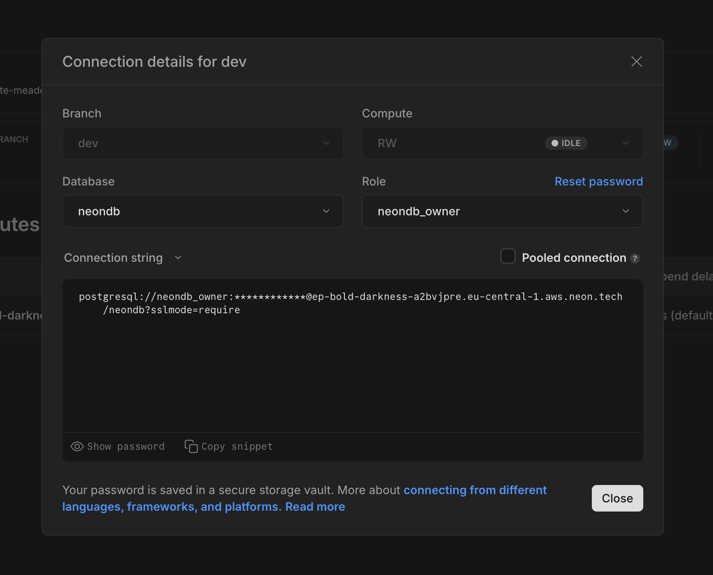

# HONC + Vector Search

This is a sample vector search app using Hono (api), Neon (postgres), Drizzle (orm), and Cloudflare workers (deployment).

We want to be able to preform semantic search across a set of recipe titles (in `data/recipe-titles.json`).

## Dev Commands

Install dependencies
```sh
npm install
```

Migrate database and seed recipes
```sh
# Set up the database
npm run db:generate
npm run db:migrate

# This adds recipe records to the database
npm run db:seed
```

Run local development server
```sh
npm run dev
```

Deploy to production (needs cloudflare account)
```sh
npm run deploy

# Set your DATABASE_URL and OPENAI_API_KEY environment variables in the Cloudflare Workers dashboard
```

## Configuring Neon

Grab your postgres connection string from [the Neon dashboard](https://neon.tech/docs/connect/connect-from-any-app), which you set as the environment variable `DATABASE_URL` in `.dev.vars`.



Alternatively, you can follow one of the scripts below.

### Create a new Database from the command line

```sh
# Authenticate with neon cli
neonctl auth

# Assuming you have a project with this name in neon
PROJECT_NAME=recipe-search-example

# Get project id because the call to `set-context` below needs it
PROJECT_ID=$(neonctl projects list --output=json | jq --arg name "$PROJECT_NAME" '.projects[] | select(.name == $name) | .id')

# Create a new database in your project
DATABASE_NAME=yum_yum
neonctl databases create --name=$DATABASE_NAME --project-id=$PROJECT_ID

# Create a `dev` db branch then set the local context file (`.neon`)
BRANCH_NAME=dev
neonctl branches create --name=$BRANCH_NAME
neonctl set-context --project-id=$PROJECT_ID --branch=$BRANCH_NAME

# Finally, add connection string to .dev.vars
DATABASE_URL=$(neonctl connection-string --database-name=$DATABASE_NAME)
echo -e '\nDATABASE_URL='$DATABASE_URL'\n' >> .dev.vars
```

### Create a new project from the command line

> **NOTE** You need to have a paid account to create more than one project. If you don't have a paid account, and you already set up your first Neon project, then this script will fail.

Install the [Neon CLI](https://neon.tech/docs/reference/neon-cli) and follow this script (you'll need the `jq` command line utility). 

```sh
npm i -g neonctl
```

Then, follow these commands to configure your database:

```sh
# Authenticate with neon cli
neonctl auth

# Create project if you haven't already
PROJECT_NAME=recipe-search-example
neonctl projects create --name $PROJECT_NAME --set-context

# Set project id because the call to `set-context` below needs it
PROJECT_ID=$(neonctl projects list --output=json | jq --arg name "$PROJECT_NAME" '.projects[] | select(.name == $name) | .id')

# Create a `dev` db branch then set the local context file (`.neon`)
BRANCH_NAME=dev
neonctl branches create --name=$BRANCH_NAME
neonctl set-context --project-id=$PROJECT_ID --branch=$BRANCH_NAME

# Finally, add connection string to .dev.vars
DATABASE_URL=$(neonctl connection-string)
echo -e '\nDATABASE_URL='$DATABASE_URL'\n' >> .dev.vars
```